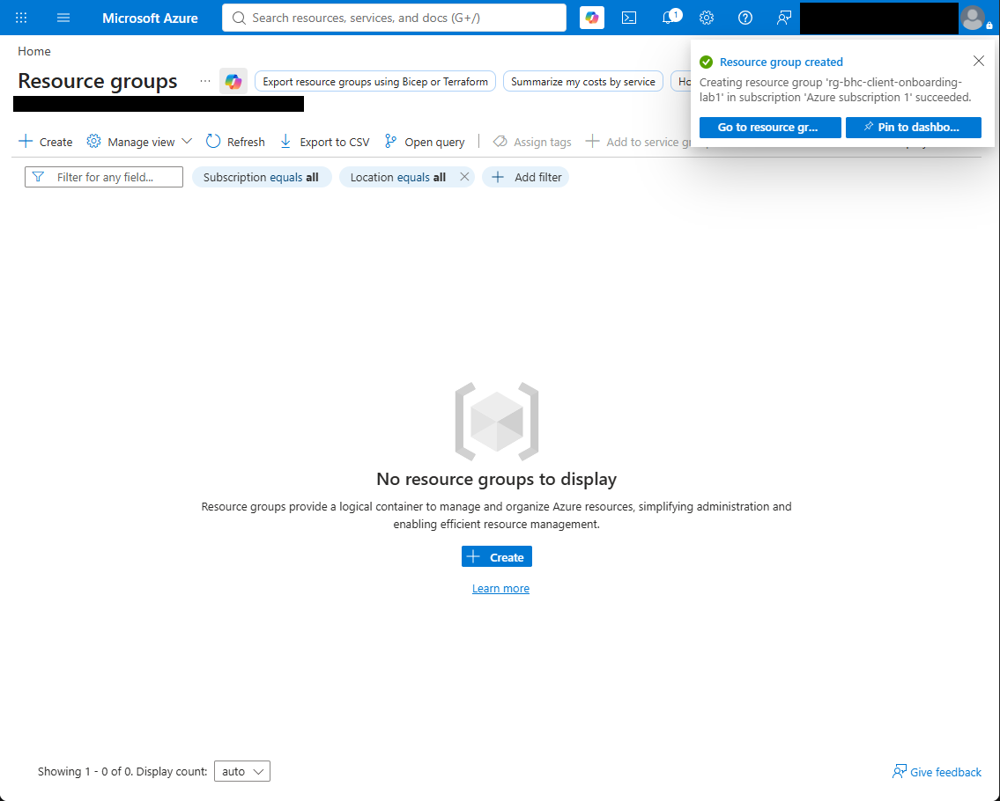
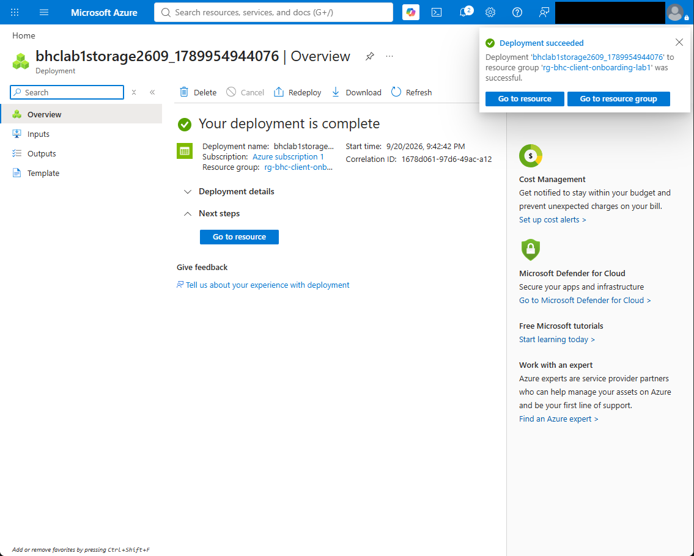
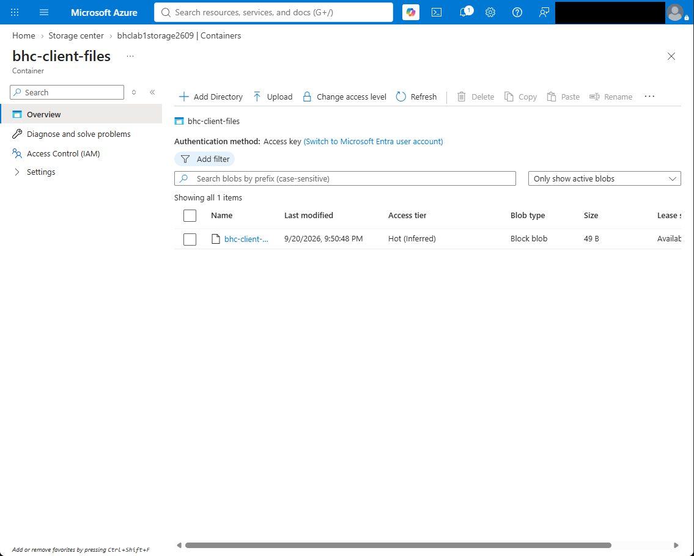
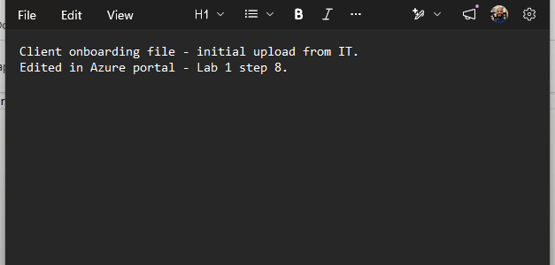
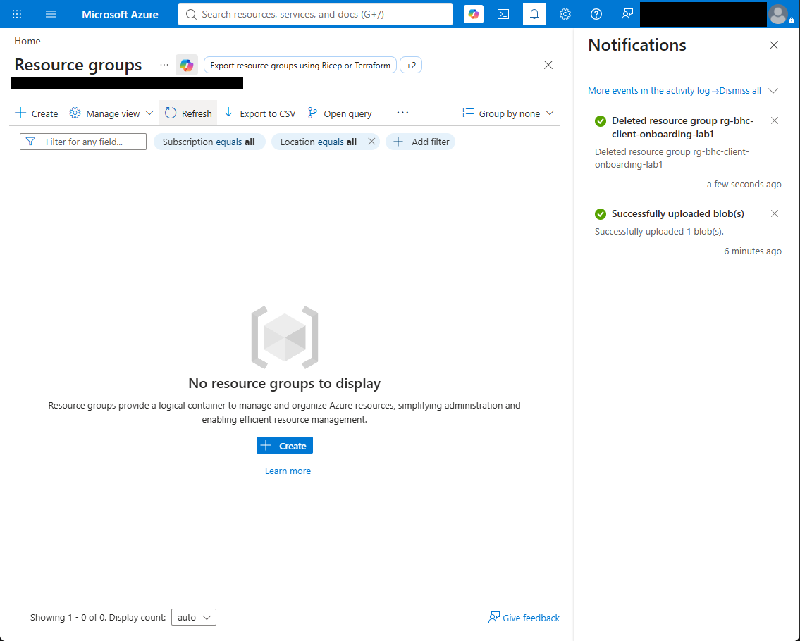
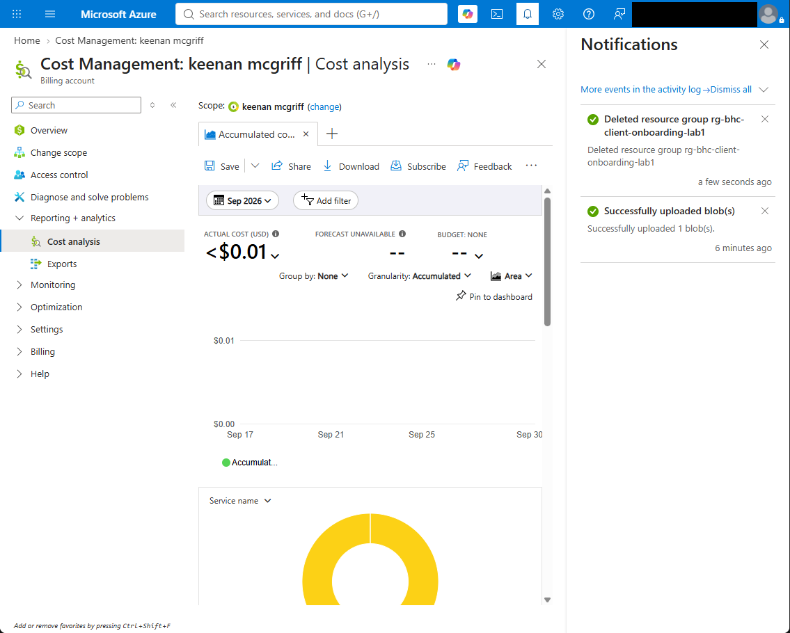

# Azure Cloud Fundamentals Lab 1

## Storage lifecycle, integrity verification, and cost cleanup

This hands-on lab documents a complete Azure Storage lifecycle in a personal training subscription: creating a resource group, deploying a storage account, using a private blob container, validating a downloaded file, and removing the resources after testing.

## What I completed

- Created `rg-bhc-client-onboarding-lab1` in East US 2.
- Deployed the `bhclab1storage2609` storage account with locally redundant storage (LRS).
- Created the private `bhc-client-files` blob container.
- Uploaded, edited, downloaded, and locally verified a test text file.
- Verified the downloaded file with SHA-256:
  `31AD564A16B1E20351F60509FD878E80353EB98BE992924B34B68BAB37938D63`
- Deleted the resource group and confirmed the lab cost remained below $0.01.

## Lifecycle

```text
Resource group
  -> Storage account
    -> Private blob container
      -> Upload / edit / download
        -> Local integrity verification
          -> Resource-group teardown
            -> Cost validation
```

## Evidence highlights

### Resource group created



### Storage account deployed



### Blob uploaded to a private container



### Downloaded file verified locally



### Resources removed after testing



### Final cost checked



The [`evidence`](evidence/) folder contains the complete numbered walkthrough from initial state through cleanup.

## Skills demonstrated

- Azure resource groups and regional resource deployment
- Azure Storage accounts and redundancy selection
- Private Blob Storage containers
- Blob upload, portal editing, and download
- Local SHA-256 integrity verification
- Resource teardown and cost-conscious lab operation
- Evidence collection with sensitive account details masked

## Troubleshooting note

During the exercise, a stale portal state produced an access error. Refreshing the portal state and continuing with the current storage resource resolved it. The final upload, edit, download, checksum verification, teardown, and cost checks all completed successfully.

## Scope

This is a personal training lab and portfolio artifact. It demonstrates hands-on Azure fundamentals; it does not claim production deployment or client work.
